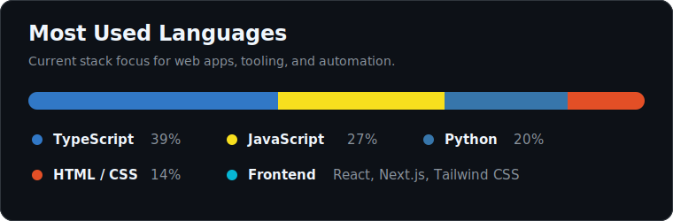

# Arty

**Developer focused on clean software, useful products, and continuous improvement.**

## About

I build software with a focus on clarity, reliability, and real-world usefulness. I enjoy transforming ideas into structured projects, improving developer workflows, and creating interfaces that feel simple, fast, and professional.

This profile is where I share my progress, experiments, and public projects as I keep building and refining my engineering practice.

## Focus Areas

- Full-stack web development
- Clean and maintainable codebases
- Product-oriented interfaces
- Automation and developer tooling
- Practical learning through shipped projects

## Tech I Work With

## Language Snapshot

## How I Approach Projects

- Keep the architecture understandable before making it clever
- Build interfaces around the user flow, not only the visual layout
- Prefer small, well-named pieces of logic over hidden complexity
- Document decisions so future work is easier to continue
- Improve projects through iteration, testing, and feedback

## Current Direction

I am currently focused on building stronger public projects, improving my full-stack workflow, and keeping this GitHub profile as a clear record of my progression.

## Contact

The best way to follow my work is through my repositories and future public releases on [GitHub](https://github.com/artyfw).
