<div align="center">



<br /><br />


<a href="https://github.com/artyfw?tab=followers"></a>

</div>

<br />


## About

```typescript
const arty = {
  role: "Full-Stack Developer",
  languages: ["TypeScript", "JavaScript", "Java", "Python", "SQL"],
  stack: {
    frontend: ["React", "Next.js", "Tailwind CSS"],
    backend: ["Node.js", "PostgreSQL"],
    also: ["Minecraft plugin engineering — Java, in production"],
  },
  focus: "Complete products, end-to-end — from schema to pixel",
  philosophy: "Understandable before clever. Shipped before perfect.",
};
```

- I build **complete products**, not demos — database, API, UI, deploy.
- Interfaces are designed around the **user flow**, then made fast.
- Side quest: **custom Minecraft server plugins** in Java, serving real player communities.


## Stack

<div align="center">


<br />


</div>


## Currently building

| Project | Stack | Status |
| :--- | :--- | :--- |
| **SaaS product** — full-stack app with real schema design, auth and a clean UI | `TypeScript` `Next.js` `PostgreSQL` | 🔒 Private — shipping soon |
| **Custom pet system** — advanced gameplay plugin for a Minecraft server | `Java` `Spigot API` | 🟢 In production |
| **Portfolio & experiments** — interfaces, animations, tooling | `JavaScript` `CSS` | 🔁 Iterating |

> Most of my work lives in private repos while it's being built — public releases land here as projects mature.


## Stats

<div align="center">


<br /><br />


<br /><br />

<picture>
  <source media="(prefers-color-scheme: dark)" srcset="https://raw.githubusercontent.com/artyfw/artyfw/output/github-contribution-grid-snake-dark.svg" />
  <source media="(prefers-color-scheme: light)" srcset="https://raw.githubusercontent.com/artyfw/artyfw/output/github-contribution-grid-snake.svg" />
  
</picture>

</div>
